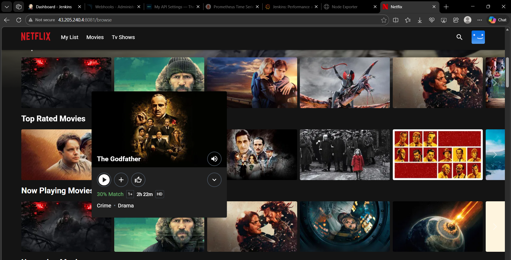
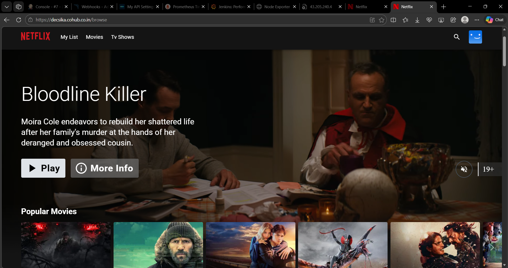

# DevSecOps--Netflix
This project demonstrates a complete DevSecOps pipeline for deploying a Netflix Clone application. It automates code integration, security scanning, containerization, deployment, and monitoring using modern DevOps tools.

## Features
- End-to-end DevSecOps CI/CD pipeline using Jenkins.
- Automated code integration with GitHub webhooks.
- Static code quality analysis using SonarQube.
- Dependency vulnerability scanning with NPM Audit and OWASP Dependency Check.
- File and container image security scanning using Trivy.
- Dynamic application security testing using OWASP ZAP.
- Automated Docker image build and push to registry.
- Application deployment using Docker and Kubernetes (Amazon EKS).
- Infrastructure provisioning using Terraform.
- Real-time monitoring with Prometheus and Grafana.
- Email and alert notifications for pipeline status.
- Secure, scalable, and automated deployment workflow.
- Continuous monitoring and observability of applications and infrastructure.

## Architecture Diagram


## Technologies used
- GitHub
- Jenkins
- Docker
- Kubernetes (Amazon EKS)
- Terraform
- AWS (EC2, EKS, IAM)
- SonarQube
- NPM Audit
- OWASP Dependency Check
- Trivy
- OWASP ZAP
- Prometheus
- Grafana
- Node.js

## Folder Structure

## How to Run the Project

### Step 1: Clone the Repository

```bash
git clone https://github.com/Decsika-tech/DevSecOps-Netflix.git
```

### Step 2. Launch AWS Infrastructure
- Create an Ubuntu 24.04 EC2 instance (t2.large, 50GB storage).
- Create an IAM role and attach Administrator permissions.
- Connect to the instance using SSH.

### Step 3. Install Required Tools
Install the following tools on the EC2 instance:
- Jenkins
- Docker
- Trivy
- Node.js
- Terraform
- kubectl
- AWS CLI

### Step 4. Configure SonarQube
- Run SonarQube as a Docker container.
- Configure SonarQube in Jenkins.

### Step 5. Set Up Monitoring
- Install Prometheus and Grafana.
- Integrate Prometheus with Jenkins.

### Step 6. Configure Notifications
- Set up Email Notifications in Jenkins.
- Install required Jenkins plugins.

### Step 7. Create Jenkins Pipeline
- Create a Pipeline project in Jenkins.
- Connect the project to the GitHub repository using a webhook.
- Configure the Declarative Pipeline (`Jenkinsfile`).

### Step 8. Run Security Scans
The pipeline performs:
- SonarQube Static Code Analysis
- NPM Audit
- OWASP Dependency Check
- Trivy File Scan
- Trivy Docker Image Scan
- OWASP ZAP Scan

### Step 9. Build and Push Docker Image
- Build the Docker image.
- Push the image to a Docker registry.

### Step 10. Deploy the Application
- Deploy the application using Docker containers or Amazon EKS.
- Access the Netflix Clone application from the browser.

## Screenshot
### Final outcomes



### Grafana response

Note: In production, the dashboards display real-time metrics.

## Contributing
Pull requests are welcome! If you find any issues, feel free to open an issue.

## Contact
For any queries, reach out at helendecsika5@gmail.com.

